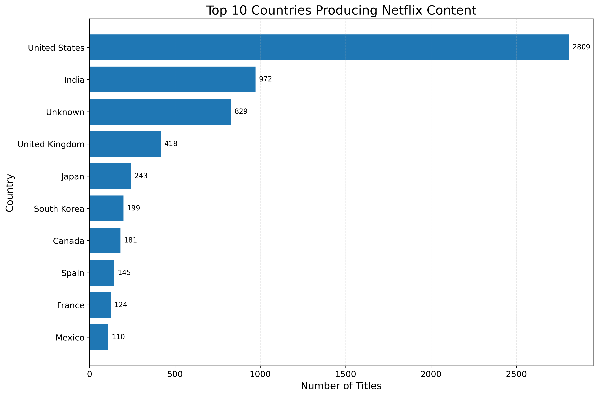
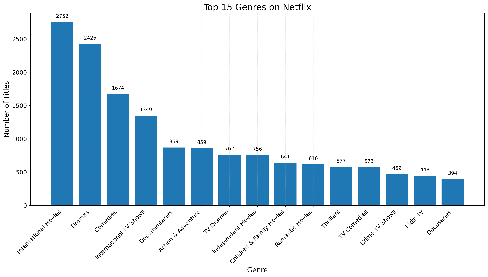
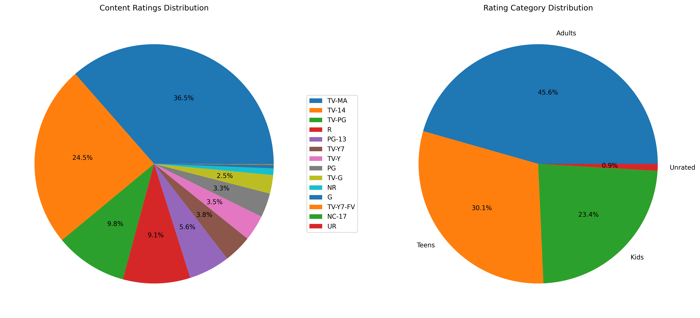
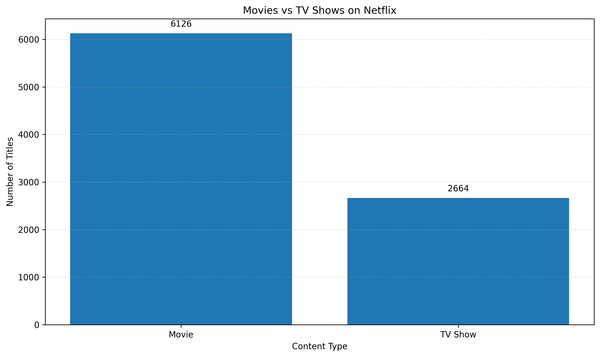
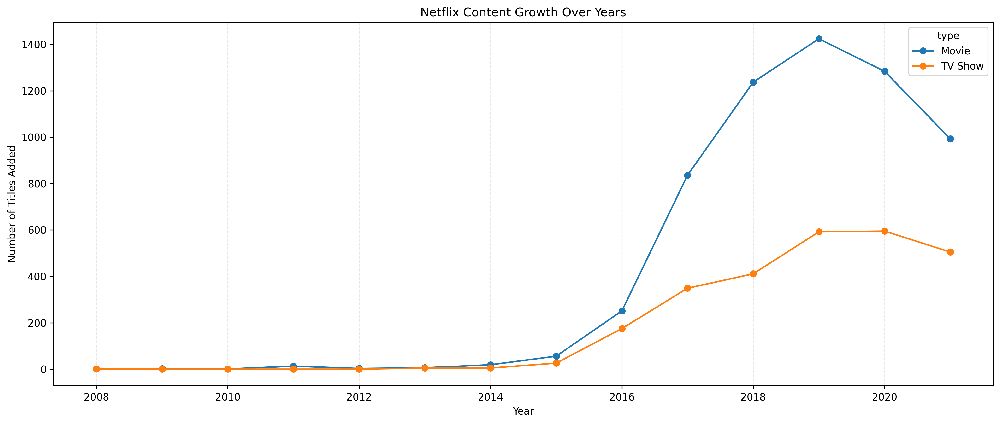
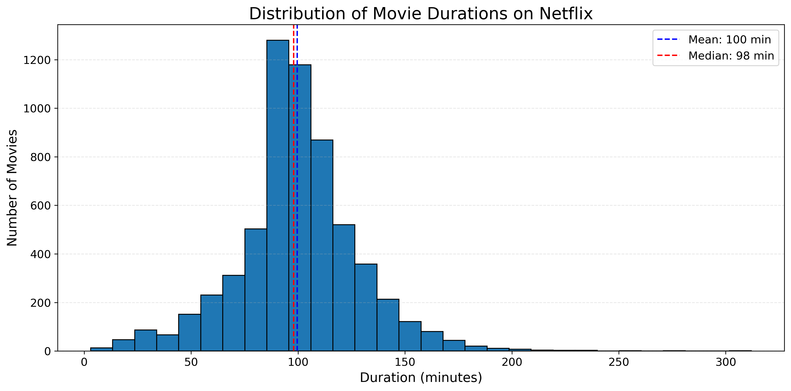
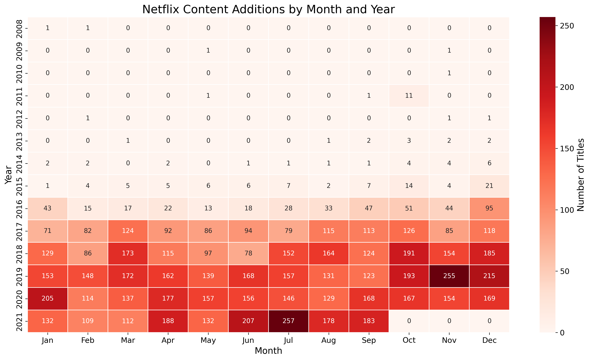

# BDA Project

Dataset: Netflix Movies and TV Shows by Shivam Bansal

URL: https://www.kaggle.com/datasets/shivamb/netflix-shows

## Research Questions

- Which countries produce the most content on Netflix?
- What are the most popular genres on Netflix?
- What is the distribution of content ratings on Netflix?
- What is the distribution of content types (movies vs TV shows) on Netflix?
- How has Netflix content grown over the years?
- What is the distribution of movie durations on Netflix?
- Are there seasonal patterns in Netflix content additions by month and year?

## Data Cleaning

### Missing Data

| Column       | Missing Values |
| ------------ | -------------- |
| show_id      | 0              |
| type         | 0              |
| title        | 0              |
| director     | 2634           |
| cast         | 825            |
| country      | 831            |
| date_added   | 10             |
| release_year | 0              |
| rating       | 4              |
| duration     | 3              |
| listed_in    | 0              |
| description  | 0              |

### Duplicates

We drop all duplicate rows.

### Handling Missing Data

We handle missing data as follows:

- Director: Fill missing with "Unknown"
- Cast: Fill missing with "No information"
- Country: Fill missing with "Unknown"

Since there are only a few missing values in these columns, we can drop the rows directly.

- Date added: Remove rows
- Rating: Remove rows
- Duration: Remove rows

### Categorizing Ratings

Based on [Netflix Rating System](https://rating-system.fandom.com/wiki/Netflix), we categorize the ratings into the following groups:

- Kids: TV-Y, TV-PG, TV-G, TV-Y7, TV-Y7-FV, PG, G
- Teens: TV-14, PG-13
- Adults: TV-MA, R, NC-17
- Unrated: UR, NR

### Date Processing

The `date_added` column is processed to extract additional time-based features:

- Convert `date_added` to datetime format
- Extract `year_added` from the date
- Extract `month_added` from the date
- Extract `month_name` from the date for better readability

## Visualizations

### Top Countries Producing Netflix Content

### Genre Distribution

### Content Ratings Distribution

### Movies vs TV Shows

### Netflix Content Growth Over Years

### Movie Duration Distribution

### Content Additions by Month and Year

